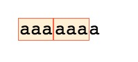
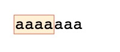
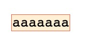
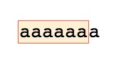
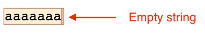
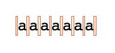
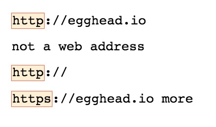
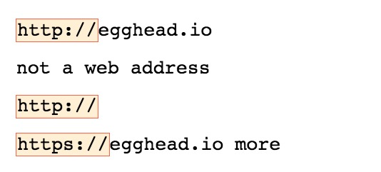

**Starter string:** "aaaaaaa"

With regex we can find any repetition of pattern inside our strings we do not need to repeat the searched char many times, we can use the `quantifiers`:
```js
const regex = /a{3}/g
```


As you can see we have two matches this time but if I change the 3 to a 4 we will get only a single match:
```js
const regex = /a{4}/g
```


Now this quantifier accept a comma that will let us assign an *at least* number that means that we need to find at least that number, if we find more go ahead and select them anyway in the same match.
```js
const regex = /a{4,}/g // Match at least four
```


But the comma `,` in our quantifier help us even for setting an *up to* (a max) to define the expected repetition of the character:
```js
const regex = /a{4,6}/g // Match at least four
```


Using this syntax we also have some special patter like `{0,}` this will match *zero to infinity* including empty strings. We barely notice this:
```js
const regex = /a{0,}/g // Match at least four
```


But this is better  visible when we use the same quantifier without a match for characters:
```js
const regex = /b{0,}/g // "b" is not in the string
```


If we need something like this we also have a shortcut to use it represented by the `*`.
```js
// They produce same result
const regex = /a{0,}/g 
const regex = /a*/g 
```

Moving on shortcuts the next one we can find and use is the `{1,}`, means *find at least one repetition*, and we can use the shorter version defined by `+`.
```js
// They produce same result
const regex = /a{1,}/g 
const regex = /a+/g 
```

If we want to match 0 or 1 instance of the character we can use the shortcut `?`, that also means *optional*.
```js
// They produce same result
const regex = /a{0,1}/g 
const regex = /a?/g 
```

## Practice
We will run some tests for the following string:
```js
var str = `http://egghead.io
not a web address
http://
https://egghead.io more`;
```

**Make a regex to find `http` and `https`**
We can make optional the `s` inside the string so we can write like so:
```js
// They produce same result
const regex = /https{0,1}/g 
const regex = /https?/g 
```


Now it's time to match also the `/`, we need to escape those because they define the pattern:
```js
// They produce same result
const regex = /https{0,1}:\/\//g 
const regex = /https?:\/\//g 
```



