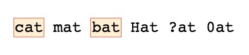
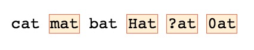
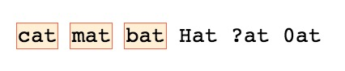
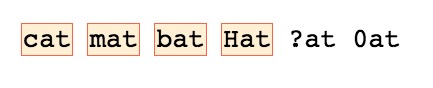
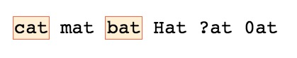
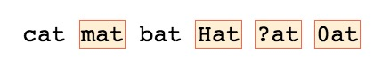
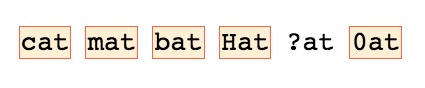
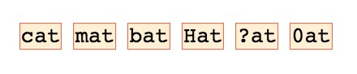

**Starter string:** "cat mat bat Hat ?at 0at"

Character classes in regular expressions allow us to identify specific sets of optional characters that we're willing to accept as part of our matches.

A character class is defined by square brakets and the order of the allowed char is not important. For example if we want to select strings that contain `at` but that needs to start with a `b` or a `c` we should write:
```js
const regex = /[cb]at/g;
```


It is also possible to **negate** a character class, means we will not accept the mathes for this class:
```js
const regex = /[^cb]at/g;
```


We can also include ranges to define a subset of allowed characters in a specific position, the range is defined with a dash `-` between the start and the end:
```js
const regex = /[a-z]at/g;
```


Is it possible to *union* multiple ranges, all we need to do is to add it to the previous without spaces:
```js
const regex = /[a-zA-Z]at/g;
```
(

The ranges don't need to be full alphabets, we can create subsets of it specifing a different end from `z` or `Z` based on case:
```js
const regex = /[a-dA-F]at/g;
```


We can also **negate a range** defined in a character class as seen previously:
```js
const regex = /[^a-dA-F]at/g;
```


For the digits we can use the range `0-9`, in this example we add it to the full alphabet range:
```js
const regex = /[a-zA-Z0-9]at/g;
```


And in order to select the missing `?` we don't need to escape it in the character class and we can simply add it as follow:
```js
const regex = /[a-zA-Z0-9?]at/g;
```

