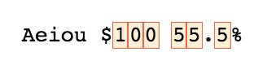

**Starter string:** "Aeiou $100 55.5%"

To select all alphanumeric character we can use the character class with a proper range:
```js
const regex = /[a-zA-Z0-9]/g;
```


But in this lesson we want to see the shorthand values that we can use, in case of an alphanumeric character we can use `\w` excluding spaces, special characters and non unicode:
```js
const regex = /\w/g;
```

If we want only digits we can use the shorthand `\d`:
```js
// They produce the same result
const regex = /[0-9]/g;
const regex = /\d/g;
```


We can match only the spaces too with `\s`:
```js
const regex = / /g;
const regex = /\s/g;
```


Since shorthand still behaves as character classes we can also negate them as learned in previous lesson:
```js
const regex = /[^a-zA-Z0-9] /g;
const regex = /[^\w]/g;
```


The negation obviously works for all the shorthands that we saw like:


Talking about shorthands we have to point out that we have those also for the **negation** part of the above:
```js
// Exclude everythins except alphanumeric
const regex = /\W/g

// Exclude everythins except  numbers
const regex = /\D/g

// Exclude everythins except spaces
const regex = /\S/g
```


