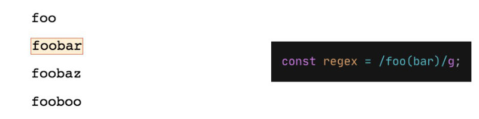
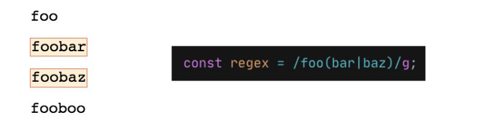
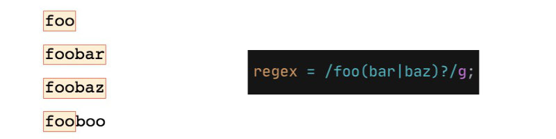

**Starting string:** `foo
foobar
foobaz
fooboo`

Capturing groups allow us to group together parts of a regular expression and then allows us to apply quantifiers to those groups of characters.

We create a capturing group in parenthesis and in this case **the order is important** because defines the sequence of letters that we're expecting.
```js
const regex = /foo(bar)/g;
```


In this example we could even not use the parenthesis but things getting interesting when we add a `|` or that will let us change the letters that we are looking for:
```js
const regex = /foo(bar|baz)/g;
```


We can also use quantifier in our captouring groups. If I want to say *'find a string that starts with `foo` followed by zero or more instances of bar or baz* the regex will be: 
```js
const regex = /foo(bar|baz)?/g;
```


But capturing groups are not useful only to apply quantifiers but they get even more useful in other circustamces. For example we can reference to the captured group:
```js
// The capturing group of the regex is bar or baz 
const regex = /foo(bar|baz)/g;
// $1 means the first capturing group found in the string
console.log(str.replace(regex, "**$1**"));

// outputs
// foo
// **bar**
// **baz**
// fooboo 
```


