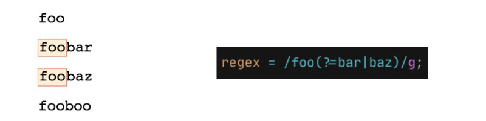
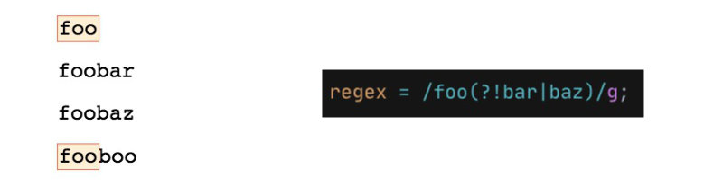

**Starter string:** `foo
foobar
foobaz
fooboo`

Lookaheads allow us to match a pattern followed by another pattern without includint the second in our match.

This is incredibly useful in cases we need to match a full pattern but then we're interested only in a subpart of the match: for example *take the domain name from all URL that ends with .com*.

To indicate the part of the pattern that we want to look for but we don't need returned we can use the `?=` and specify after it the pattern.
```js
const regex = /foo(?=bar|baz)/g;
```


We can also exclude the pattern inside the lookahead we change slightly the operator in `?!`.

So if I want to find all the *foo* that are not followed by *bar* or *baz*:
```js
const regex = /foo(?!bar|baz)/g;
```

