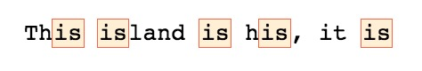

**Starter string:** `This island is his, it is`

Define the start and end of a word is really important since it helps us to have good results. Working with the string above let's say I want only the word **is**.

If I'll write the following regex `/is/g` I will get all the is I am looking for **plus** something that I do not want at all.



The first step to improve this is to use a boundary that let us tell to the regex engine that we are interested in words that starts with the characters defined in it, doing so will exclude all words that have *is* at the middle or end.

To say that we want words that start with something we need to use `\b`.
```js
const regex = /\bis/g;
```


We can use the same boundary to identify that the string we're looking for needs to end as well:
```js
const regex = /\bis\b/g;
```

With the above we select only word composed by the letter *i* and *s* in this specific order, but we can also negate a boundary:
```js
// Not starts with
const regex = /\Bis/g;
```

```js
// Not ends with
const regex = /is\B/g;
```


