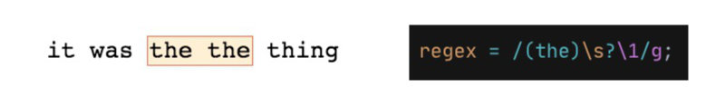
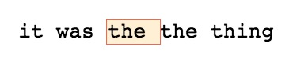

**Starting string:** `it was the the thing`

As already seen in the capturing groups lesson, we are able to define a specific set of characters that needs to be present and in the same order.

The above string presents a repetition and we want to select *the the* but we don't want to write something like `/(the)\s?(the)/` because even if it works we need to leverage the power of the computer.

To put this to work we need to leverage the powers of **backreferences** inside our regular expressions, with those we can reference a pattern already defined previously:
```js
const regex = /(the)\s?\1/g;
```


But selecting the same thing twice is not the point of this exercise, we would like to get rid of the repetition but if we would use this regex in a `replace()` method, maybe to change it with an empty string we will lose them both.

This is the perfect case to use a lookahead:
```js
const regex = /(the)\s?(?=\1)/g;
```


With this in place now we can easily get rid of the repetition with:
```js
str.replace(regex, '');
```

This tecqnique is really useful to strip out HTML tags :wink:
